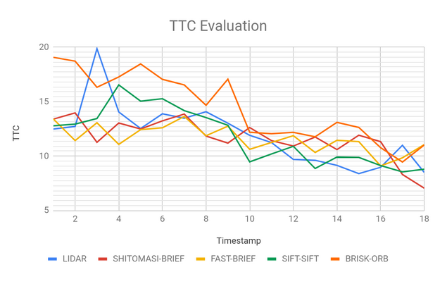

# SFND 3D Object Tracking

Welcome to the final project of the camera course. By completing all the lessons, you now have a solid understanding of keypoint detectors, descriptors, and methods to match them between successive images. Also, you know how to detect objects in an image using the YOLO deep-learning framework. And finally, you know how to associate regions in a camera image with Lidar points in 3D space. Let's take a look at our program schematic to see what we already have accomplished and what's still missing.

In this final project, you will implement the missing parts in the schematic. To do this, you will complete four major tasks:

1. First, you will develop a way to match 3D objects over time by using keypoint correspondences.
2. Second, you will compute the TTC based on Lidar measurements.
3. You will then proceed to do the same using the camera, which requires to first associate keypoint matches to regions of interest and then to compute the TTC based on those matches.
4. And lastly, you will conduct various tests with the framework. Your goal is to identify the most suitable detector/descriptor combination for TTC estimation and also to search for problems that can lead to faulty measurements by the camera or Lidar sensor.

## Reflection Based on Suggested [Rubic Points](https://review.udacity.com/#!/rubrics/2550/view)

### FP.1 Match 3D Objects

The main step in order to efficiently calculate time to collision, is to keep tracks of the detected objects in the environment around the Ego Vehicle, this is done by using matches between each consecutive frames to associate bounding boxes detected by YOLO Network.

This is implemented inside *matchBoundingBoxes* function in file *camFusion_Student.cpp* Lines 289 - 369

### FP.2 Compute Lidar-based TTC

Calculating the Time to Collision based on Lidar data , is done by filtering outliers using shrinking factor of bounding box and take average distance of filtered points, then differentiating between each two consecutive frames to estimate the relative velocity between The Ego and preceding vehicle.

This is implemented inside *computeTTCLidar* function in file *camFusion_Student.cpp* Lines Lines 240-286

**Note**: Other filtering methods have been experimented but tend to give worse result ex. Inter Quartile Range check.

### FP.3 Associate Keypoint Correspondences with Bounding Boxes

Prepare the TTC computation based on camera measurements by associating keypoint correspondences to the bounding boxes which enclose them.
In order to filter outliers, Inter Quartile Range test was preformed to reject in outlier far from IQR region.

This is implemented inside *clusterKptMatchesWithROI* function in file *camFusion_Student.cpp* Lines Lines 158-184

### FP.4 Compute Camera-based TTC

Calculating the Time to Collision based on Camera Images , is done by comparing the keypoints matches distance between each two consecutive frames.

This is implemented inside *computeTTCCamera* function in file *camFusion_Student.cpp* Lines Lines 188-237

### FP.5 Performance Evaluation 1

Lider based Time to collision tends to give good based results compared with camera but can be way off due to outliers like in frames 3 and 17 where the TTC Jumped due to nearby outliers

### FP.6 Performance Evaluation 2

Several combinations of Keypoint detector/ descriptor have been experimented to construct an overview on which combinations are the best to be used in this pipeline.

Result of this analysis is attached with the Repo in a separate CSV file.

## Dependencies for Running Locally

* cmake >= 2.8
  * All OSes: [click here for installation instructions](https://cmake.org/install/)
* make >= 4.1 (Linux, Mac), 3.81 (Windows)
  * Linux: make is installed by default on most Linux distros
  * Mac: [install Xcode command line tools to get make](https://developer.apple.com/xcode/features/)
  * Windows: [Click here for installation instructions](http://gnuwin32.sourceforge.net/packages/make.htm)
* Git LFS
  * Weight files are handled using [LFS](https://git-lfs.github.com/)
* OpenCV >= 4.1
  * This must be compiled from source using the `-D OPENCV_ENABLE_NONFREE=ON` cmake flag for testing the SIFT and SURF detectors.
  * The OpenCV 4.1.0 source code can be found [here](https://github.com/opencv/opencv/tree/4.1.0)
* gcc/g++ >= 5.4
  * Linux: gcc / g++ is installed by default on most Linux distros
  * Mac: same deal as make - [install Xcode command line tools](https://developer.apple.com/xcode/features/)
  * Windows: recommend using [MinGW](http://www.mingw.org/)

## Basic Build Instructions

1. Clone this repo.
2. Make a build directory in the top level project directory: `mkdir build && cd build`
3. Compile: `cmake .. && make`
4. Run it: `./3D_object_tracking`.
